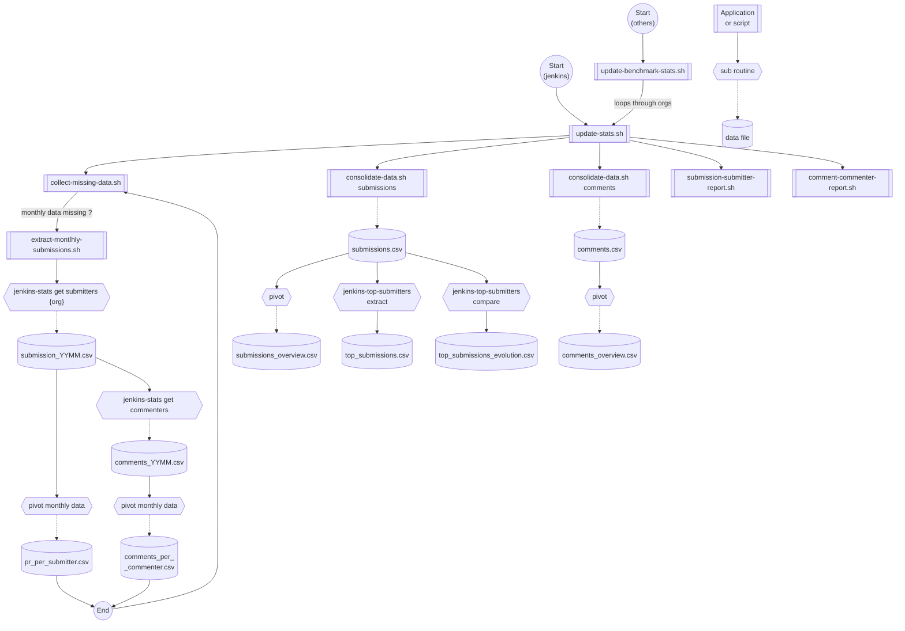

# Jenkins contribution statistics

A set of tools to extract and analyze the number of software contributions and their submitter.
This is a strict interpretation of "contribution". Other statistics (lile those from the Linux Foundation), analyse *all* interactions with a project (PR, comment, issue creation, review).

## Suggested usage

1. Retrieve data since the last time the script ran with `./collect-missing-data.sh`.
1. Update/create the consolidated data file with `./consolidate-data.sh`.
1. Update/create global summary file (nbr submitters and submissions per month) with `./submission-submitter-report.sh`.

All the above operations can be performed with `update-stats.sh`

## Script list

Following scripts are available:
- `check-prerequisites.sh` checks whether all required programs are available on the system
- `extract-monthly-submissions.sh` extracts the monthly data from GitHub and stores it in ,/data/ directory as a CSV file. It also generates a list with the number of PR for each submitter in the given month.
- `consolidate-data.sh` takes all the available monthly data and creates a single data file, `consolidated_data/submissions.csv`. If a data file already exists, it is backuped.
- `collect-missing-data.sh` will extract all the monthly data files since **JAN-2020**. If the output already exists, it will skip that particular month.
- `submission-submitter-report.sh` uses the existing monthly data to generate a summary CSV with the number of submissions and the number of submitters. The resulting output is stored in `consolidated_data/summary_counts.csv`

- `update-stats.sh` is the script that performs the necessary update operation in sequence

## Produced datafiles

| File name | Comment | produced by |
| -------------------------------------------- | ------------------------------------------------ | -------------------------------- |
| `data/submissions-YYYY-MM.csv`               | List of PRs created in a given month             | `extract-monthly-submissions.sh` |
| `data/pr_per_submitter-YYYY-MM.csv`          | Nbr of PRs submitted by a user for a given month | `extract-monthly-submissions.sh` |
| `data/comments_YYYY-MM.csv`                  | List of comments created in a given month        | `extract-monthly-submissions.sh` |
| `data/comments_per__commenter-YYYY-MM.csv`   | Nbr of comments made by a user for a given month | `extract-monthly-submissions.sh` |
| `consolidated_data/submissions.csv`          | All extracted submissions (since Jan 2020)       | `consolidate-data.sh submissions` |
| `consolidated_data/submissions_overview.csv` | Global submissions pivot table (user/month -> nbr prs)   | `consolidate-data.sh submissions` |
| `consolidated_data/top_submissions.csv`      | 35 top submitters over the last 12 month                 | `consolidate-data.sh submissions` |
| `consolidated_data/top_submissions_evolution.csv` | New or churned top submitters (compared to 3 months before) | `consolidate-data.sh submissions` |
| `consolidated_data/comments.csv`             | All extracted comments (since Jan 2020)                  | `consolidate-data.sh comments` |
| `consolidated_data/submissions_overview.csv` | Global comments pivot table (user/month -> nbr comments) | `consolidate-data.sh comments` |
| `consolidated_data/top_submissions.csv`      | 35 Top commenters over the last 12 months                | `consolidate-data.sh comments` |
| `consolidated_data/top_submissions_evolution.csv` | New or churned top commenters (compared to 3 months before) | `consolidate-data.sh comments` |

## pre-requisite

Prerequisites are checked with `check-prerequisite.sh`. 
This is the list of executables that have to be installed in order for the automation to work.

- `gh` : the Github command line utility
- `jq` : Json query tool
- `datamash` : data manipulation tool (CSV pivots)
- `jenkins-top-submitters` : extracts the to submitters or commenters from the global pivot tables
- `jenkins-stats` : various extraction and jenkins data handling tools
- `gdate` : GNU date manipulation tool for Mac OS (part of `coreutils`, installable with brew)

## Data and process flow

Not to self: to generate the mermaid graphic by hand `docker run -i -t --rm -v "$PWD:/data"  jmmeessen/render-md-mermaid:v2`

  
diagram source

  This details block is collapsed by default when viewed in GitHub. This hides the mermaid graph definition, while the rendered image
  linked above is shown. The details tag has to follow the image tag. (newlines allowed)

